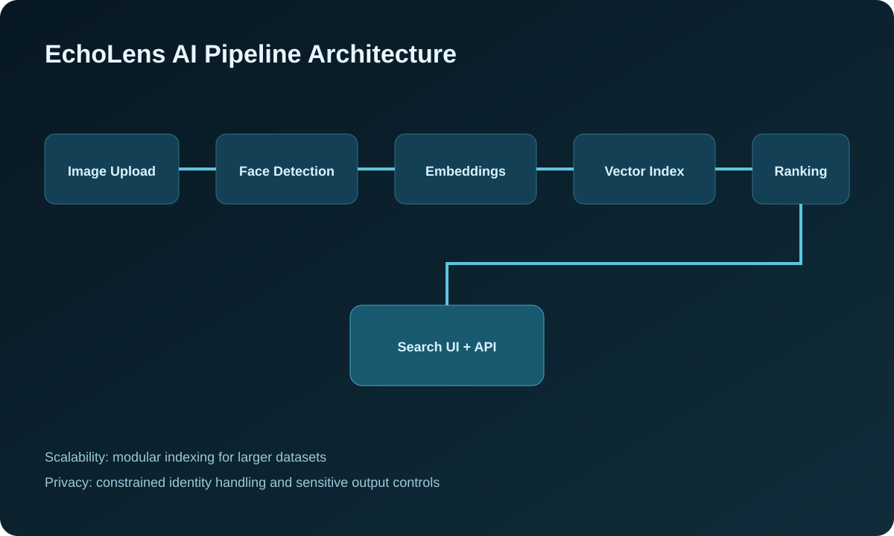

# EchoLens

EchoLens is an intelligent event photo search system built with Streamlit. It helps users find photos of a specific person across a large event gallery by uploading one clear reference image and scanning a batch of event photos for visual face matches.

The app is designed to feel like a real AI product: branded UI, session-only privacy defaults, confidence filtering, reliability metrics, manual review labels, ZIP export for matched photos, and CSV export for evaluation.

## Features

- Upload one clear reference face image.
- Detect and encode the reference face.
- Upload many event photos at once.
- Detect every face in each event photo.
- Compare event faces against the reference face using face embeddings.
- Display matched photos in a clean gallery.
- Show confidence scores and low-confidence warnings.
- Filter results by confidence level.
- Manually mark matches as correct or incorrect.
- Download matched photos as a ZIP file.
- Download evaluation results as a CSV file.
- View a reliability dashboard with scan statistics and charts.
- Clear uploaded images and face data from the Streamlit session.
- Use `EchoLens Logo.png` as the branded app logo.

## Project Visuals

### Logo


### Architecture Diagram



This diagram represents the high-level processing flow, not a one-to-one map of source files.

If the image does not render in your Markdown viewer, open `assets/echolens-architecture.svg` directly.

## Project Structure

```text
EchoLens/
├── app.py
├── EchoLens Logo.png
├── requirements.txt
├── README.md
├── .gitignore
├── .streamlit/
│   └── config.toml
└── src/
    ├── __init__.py
    ├── face_matcher.py
    ├── image_utils.py
    └── reporting.py
```

## Required Libraries

- `streamlit` for the web app interface.
- `face-recognition` for face detection and 128-dimensional face embeddings.
- `opencv-python` for computer vision project compatibility and future image-processing upgrades.
- `Pillow` for image loading and orientation correction.
- `numpy` for embedding and distance calculations.
- `pandas` for evaluation tables and CSV export.
- `matplotlib` for reliability dashboard charts.

## Installation

Python 3.10 or 3.11 is recommended.

```powershell
python -m venv .venv
.\.venv\Scripts\Activate.ps1
python -m pip install --upgrade pip
pip install -r requirements.txt
streamlit run app.py
```

Then open the local Streamlit URL shown in the terminal.

### Windows note

The `face-recognition` package depends on `dlib`. If installation fails on Windows, install CMake and Microsoft Visual C++ Build Tools, then run:

```powershell
pip install cmake
pip install dlib
pip install -r requirements.txt
```

## How Face Matching Works

EchoLens uses the `face_recognition` library to detect faces and generate embeddings. A face embedding is a numeric vector that represents the visual identity features of a face.

1. The user uploads a reference image.
2. EchoLens detects faces in that image.
3. If multiple faces are detected, the largest face is used as the reference.
4. The reference face is converted into an embedding.
5. Each uploaded event photo is scanned for faces.
6. Every detected event face is converted into an embedding.
7. EchoLens compares each event embedding to the reference embedding using face distance.
8. If the best distance is below the selected threshold, the photo is marked as a match.

The confidence score is a readable score derived from face distance. It is useful for ranking and review, but it should not be treated as a guaranteed identity claim.

## Privacy and Responsible AI

EchoLens is intended for personal and event photo organization. It does not use a database and does not permanently store uploaded photos, face embeddings, or face data by default. Uploaded files and scan results live only inside the Streamlit session unless the user downloads a ZIP or CSV export.

The app also warns users when matches have lower confidence, because those results should be manually reviewed before sharing, archiving, or making decisions from them.

## Reliability Dashboard

The dashboard reports:

- Total images uploaded
- Total faces detected
- Matched photos
- Unmatched photos
- Average confidence score
- Low-confidence matches
- Match confidence distribution

These metrics help explain model behavior and make the project more resume-worthy than a simple upload-and-output demo.

## Future Improvements

- Add DeepFace or InsightFace as an optional backend.
- Add GPU acceleration for large event galleries.
- Add face bounding-box previews on matched photos.
- Add duplicate-photo detection.
- Add persistent user-approved project folders.
- Add semantic search such as "show photos where I am smiling" or "show group photos."
- Add clustering to group event attendees automatically.
- Add authentication and per-user galleries.
- Add automated evaluation using labeled test galleries.
- Deploy the Streamlit app to a cloud host.

## Resume Bullets

- Built EchoLens, a Streamlit-based AI photo search app that identifies a target person across event photo batches using face embeddings and similarity thresholds.
- Implemented reference-face detection, batch face scanning, confidence scoring, low-confidence warnings, and downloadable ZIP/CSV exports.
- Designed a privacy-conscious AI workflow that processes uploaded images in-session without permanent face storage by default.
- Added a reliability dashboard with Pandas and Matplotlib to track images scanned, faces detected, match counts, average confidence, and review quality.
- Structured the project into reusable Python modules for face matching, image handling, reporting, and UI orchestration.

## Run the App

```powershell
streamlit run app.py
```

Upload a clear reference image first, then upload the event photos, adjust the threshold if needed, and scan.
